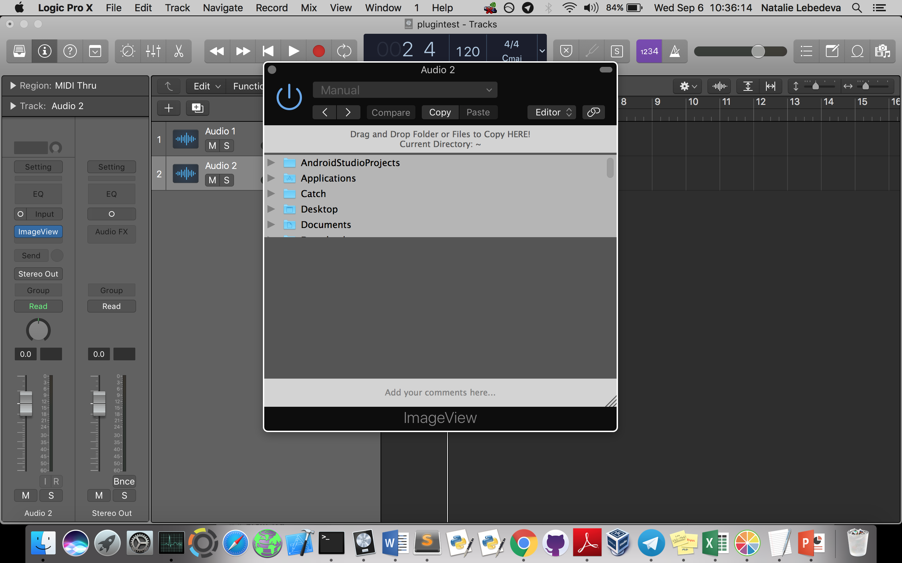

# ImageView2.0
Plug-in for DAWs written in C++ using JUCE
ImageView is an audio plugin that allows the user to view images in a directory of her choosing and copy images to the directory. 

1. Create a folder corresponding to audio track (optional).
2. Open the plug-in and drag and drop the folder you just created or the project folder.
3. Drag and drop your pictures of analog gear settings* (i.e. knob positions, diagrams etc.) to the folder you created. This will copy the files to the folder.
4. Quickly access and view your pictures from the plug-in; you can also write comments in the text editor below the image viewer.
*- the plug-in will work with other types of pictures as well; you can attach pictures of cats, puppies, or your favorite Home Depot aisles

=> The plug-in displays JPG, JPEG, PNG, and GIF images.
=> While copying files, make sure that all images have unique names; the plugin replaces an image with the same name with a new one.

